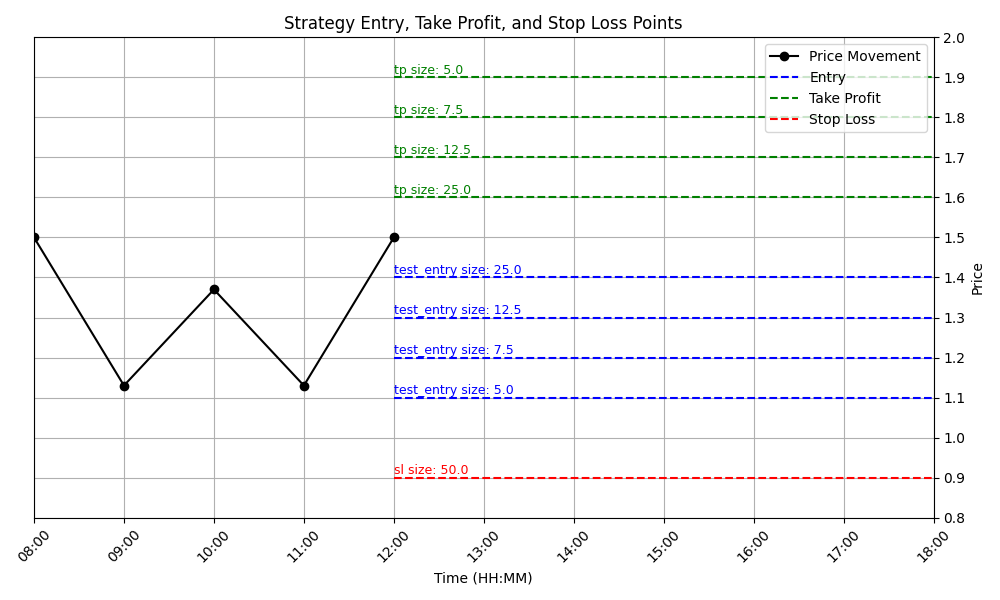
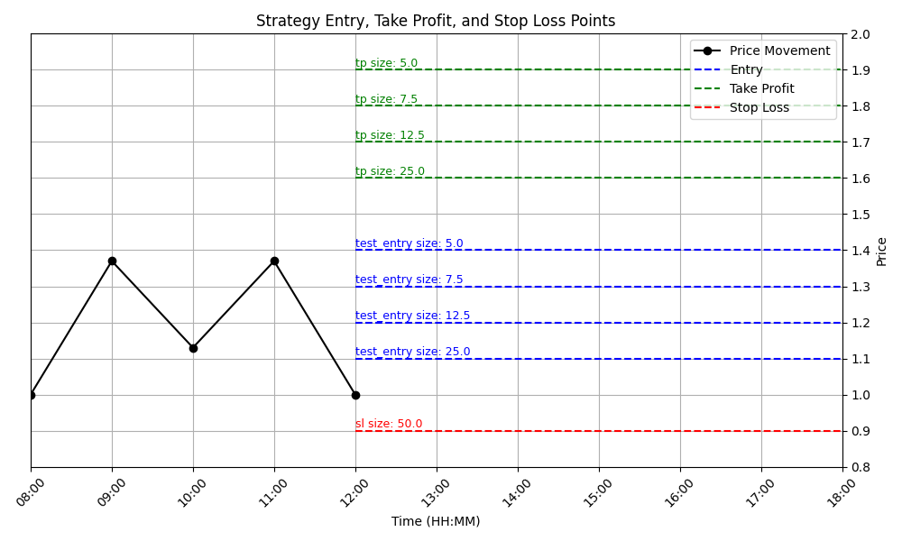
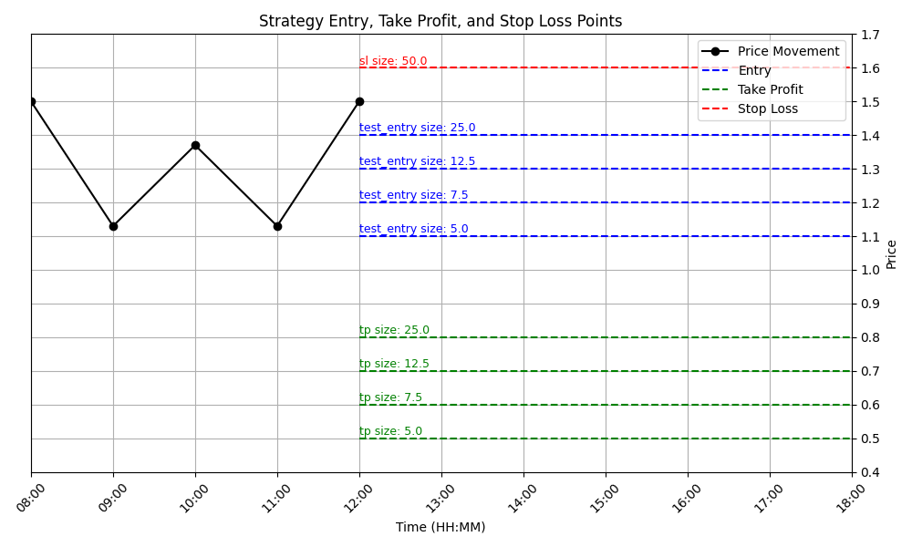

# Strategies
A collection of trading strategies

## Table of Contents
- [Dynamic Gradient Entry Strategy](#dynamic-gradient-entry-strategy)

## Dynamic Gradient Entry Strategy
The Dynamic Gradient Entry Strategy is a strategy designed to optimize entry and exit points in trading, leveraging a dynamic approach to risk management and order placement. This strategy allows traders to scale into positions with varying order sizes based on predefined risk parameters and market conditions.

### Features
- Dynamic Order Sizing: Adjusts the size of each order based on a total risk percentage and a predefined list of order sizes.
- Adaptive Entry Points: Calculates equally spaced entry points within a specified price range, allowing for strategic position entries.
- Versatile Market Signals: Adapts to both buy and sell signals, with special considerations for market price relative to the entry range.
- Precision Pricing: Rounds order prices to a specified precision, accommodating various market and exchange requirements.
- Comprehensive Order Preparation: Generates detailed order information, including entries, take profits, and a stop loss, tailored to current market conditions and strategy requirements.

### Visualization
#### Buy Above Entry Price Range

#### Buy Below Entry Price Range

#### Sell Above Entry Price Range

#### Sell Below Entry Price Range
